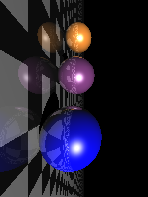

# Simple-Raytracer

c++ implementation of the python code : 
[raytracing.py](https://gist.github.com/rossant/6046463)

Output:

Current output figure : [PPM](https://en.wikipedia.org/wiki/Netpbm_format)
